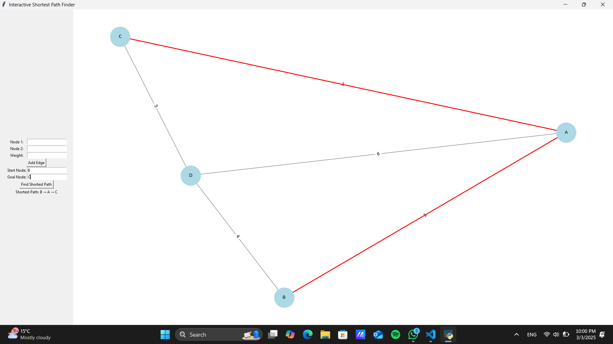

# Shortest Path Finder

## 🚀 Overview
The **Shortest Path Finder** is a Python-based project that implements graph traversal algorithms to find the shortest path between two nodes. This tool can be used for navigation systems, network routing, and AI pathfinding problems.

## ✨ Features
- Supports **Dijkstra's Algorithm** and **A* Search Algorithm**.
- Visual representation of the shortest path.
- Handles weighted and unweighted graphs.
- Interactive user input for selecting source and destination nodes.

## 🛠 Tech Stack
- **Python** (Core logic)
- **NetworkX** (Graph representation)
- **Matplotlib** (Visualization)

## 📌 Installation
To set up the project locally, follow these steps:

```bash
# Clone the repository
git clone https://github.com/Paarth01/Shortest-Path-Finder.git

# Navigate to the project directory
cd Shortest-Path-Finder

# Install dependencies
pip install -r requirements.txt
```

## 🚀 Usage
Run the script to start the shortest path finder:

```bash
python main.py
```

Follow the prompts to enter the graph details and select the algorithm to find the shortest path.

## 📊 Algorithms Used

### 1️⃣ Dijkstra's Algorithm
- Works with **weighted graphs**.
- Uses a priority queue to explore the shortest path.
- Time complexity: **O((V + E) log V)**.

### 2️⃣ A* Search Algorithm
- Works with **weighted graphs** and incorporates heuristics.
- Uses a cost function: `f(n) = g(n) + h(n)`, where:
  - `g(n)`: cost from start node to `n`
  - `h(n)`: estimated cost from `n` to goal
- Time complexity: **O((V + E) log V)**.

## 🎨 Visualization
The program plots the graph using **Matplotlib** to display the shortest path dynamically.


## 🤝 Contributing
Feel free to fork this repository, improve it, and submit a pull request! 🎯

## 📜 License
This project is licensed under the **MIT License**.

---
### 👨‍💻 Author: [Paarth](https://github.com/Paarth01)
